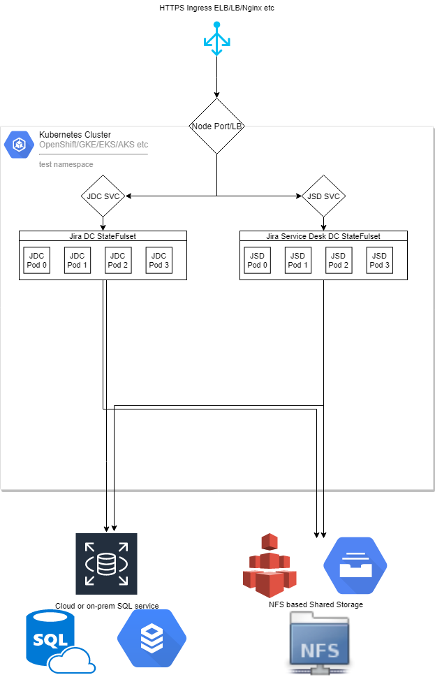

# Atlassian-Kubernetes
All things [Atlassian](https://atlassian.com) and [Kubernetes](kubernetes.io)!

This repo is to show a general idea on how to deploy the entire Atlassian stack on Kubernetes.

Support for [Data Center Versions](https://www.atlassian.com/enterprise/data-center) is in progress. [Jira Data Center](https://www.atlassian.com/enterprise/data-center/jira) & [Jira Service Desk DC](https://www.atlassian.com/software/jira/service-desk/enterprise/data-center) is now managed via a statefulset. Check it out! 

This is not a Production Ready Service. You will need to build your own deployments and use the correct resources.
* NFSv4 can be problematic with Git workloads, with correct tuning for each workload, this can be a viable option, though NFSv3 is recommended via HostPaths for performance environments! Please keep this in mind for Bitbucket and Bamboo deploys.
* Upgrades are untested. Jira does support ZDU though

# Atlassian Software
More details on this software can be found [here](https://www.atlassian.com/enterprise/data-center) and Trial and Eval licences can be generated [here](https://my.atlassian.com)

# Docker Images
This deployment uses two containers. Offical Atlassian at https://hub.docker.com/u/atlassian/ and dchevell's images: https://hub.docker.com/u/dchevell

* Please note not all images are supported by Atlassian in production or Data Center deployments
* Some images are not official and include OpenJDKs & logic for clustering

# This is work in progress!

### Getting Started ###
You will need:
* A Kubernetes Cluster
* Ansible
* A Valid kubectl config file & Context (~/home/.kube )
* At least 16GB~ of Memory in the Cluster
* [NFS Volumes or Persistent Disk Backing](https://kubernetes.io/docs/concepts/storage/volumes/#types-of-volumes) that supports ReadWriteMany for Data Center
* A Node IP or Elastic IP (GKE) to expose the services outside the cluster or Ingress Controller

This has been tested with:
* GKE
* Kubernetes 1.13 on vSphere
* HAProxy L4/L7 Ingress

### High Level Architecture:
These deployments take the simplest approach to deploy Atlassian software to k8s. Here's a quick  to help understand how you can best apply it for you infrastructure. Generally, this means:
* BYO Database
* BYO Shared Storage

### Understating Persistence in K8s ###
Unless properly backed by a volume, your data will not persist. Each service has the following;
* K8S Volume
* K8S Volume Claim
* Deployment Volume Mount ( consumer of the above )

You can edit the volume.yml files to use any Disk backing supported by K8s, however please note that performance items need to be considered. Volumes hosting Git repos especially.

You must deploy a volume supporting "ReadWriteMany" in order to deploy multiple replicas and run "Data Center" versions of these products.  You can leverage NFS outside the cluster, or services such as GlusterFS.

# Create a Namespace
All the services will live within one namespace, test or production. All services are deployed to this namespaces explicitly.
You may need to define your kubectl context such as "kubectl apply -f foo.yml --namespace=test" 

```kubectl create ns my-namespace```

# Edit Volumes
Volumes are created and configured in ${product}/prod_volume*.yml
* Samples use a NFS Server
* Most settings are part of ${product}/envs.yaml
* Adjust these volumes to suit your needs


# Create an Database Application Deployment
Deploy a [sample Postgres instance](https://github.com/Bonn93/atlassian-kubernetes/tree/master/database)

I've built a quick database to use for this sample deployment found [here](https://cloud.docker.com/u/mbern/repository/docker/mbern/postgres-atlas-all)

This has several databases included which can be used with each application deployment below.

Production deployments are still best of using Managed SQL services like Cloud SQL, RDS or real database deployments for sake of sanity and protection. If you understand how databases, docker and kubernetes works, then fire away!

You may need to increase the max_connections on this deployment later on to scale each statefulset. This can be done by editing the postgres.conf on the NFS volume backing it, delete the pod and let the replicaset recreate a new pod for this service. Or tuning your SQL instance.
 
# Jira Data Center is now working via v1/statefulSets!
* You must use an external database 
* You must have an NFS or ReadWriteMany supported PVC ( NFS, GlusterFS etc )
* The application must be configured and setup prior to scaling the deployment
More details [here](https://github.com/Bonn93/atlassian-kubernetes/blob/master/jira/readme.md)


# Deploy product via Ansible:
### [Bamboo](https://github.com/Bonn93/atlassian-kubernetes/blob/master/bamboo/readme.md)
### [Jira Data Center](https://github.com/Bonn93/atlassian-kubernetes/blob/master/jira/readme.md)
### [Jira Service Desk Data Center](https://github.com/Bonn93/atlassian-kubernetes/blob/master/jira-servicedesk/readme.md)
### Confluence: Coming Soon!
### [Bitbucket](https://github.com/Bonn93/atlassian-kubernetes/blob/master/bitbucket/readme.md)
### Crowd: Coming Soon!
### FeCru: Coming Soon!

# Configure products:
* After a successful deployment, each application should be available via HTTP internally and externally
* Configure applications, such as database, language, themes and license 

# Exposing services
I included service's for each application, exposing this is dependent on your setup such as GKE + LBs or using an Ingress controller. Consult the documentation for these methods or your cluster admins. 


# Tips:
### Get deployments & statefulsets:
```kubectl -n $namespace get deploy```

```kubectl -n $namespace get sts```

```kubectl -n $namespace describe sts/$my-sts```

```kubectl -n $namespace describe deploy/$my-deploy```

### Get pod and Pod details:
```kubectl -n $namespace get po```

```kubectl -n $namespace describe po <podname>```

### Volumes & Config Maps
```kubectl -n test get pv```

```kubectl -n test get pvc```

```kubectl -n test get configmap```

```kubectl -n test descibe pv/$my-pv```

```kubectl -n test descibe pvc/$my-pvc```

```kubectl -n test descibe configmap/$my-configmap```

### Container Shell:
```kubectl -n $namespace exec -it <podname> /bin/bash```

# Data Center Versions:
This is currently in progress as the most valuable part of this project. Jira DC and JSDDC is now working and seems mostly stable. Work has started for Confluence and Bitbucket.

# Additional Notes:
* Containers run as daemon, there is not root involved
* Hazelcast ( clustering on Bitbucket and Confluence ) does not have native support for k8s or discovery, multi-cast is also not supported due to networks not supporting this
